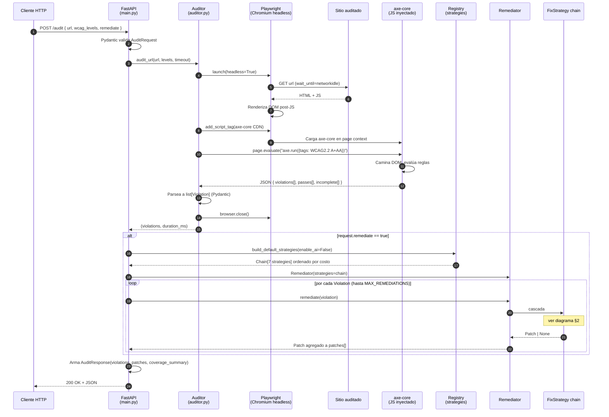
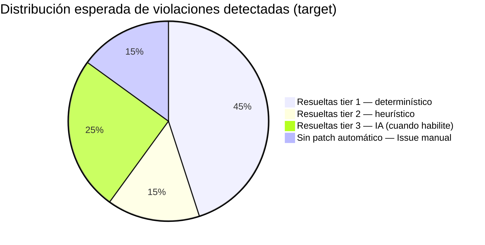

# Flujo del motor — FARO Spike

> Documentación técnica del flujo end-to-end del worker de auditoría +
> remediación. Renderizá los diagramas en GitHub (soporte nativo Mermaid),
> en VS Code con la extensión "Markdown Preview Mermaid Support", o en
> [mermaid.live](https://mermaid.live) para exportarlos como PNG/SVG.

---

## 1. Diagrama de secuencia — request `POST /audit`

Camino completo de una request desde que llega al endpoint hasta que el
cliente recibe la respuesta JSON.

---

## 2. Cascada del Remediator

Lógica interna del `Remediator.remediate()` para una sola `Violation`. La
cadena se recorre en orden de costo creciente. La primera estrategia que
devuelva un patch con `confidence >= medium` corta la búsqueda.

```mermaid
flowchart TD
    Start([Violation entra al Remediator]) --> Loop{¿Más strategies<br/>en la cadena?}

    Loop -- No --> Fallback{¿Hay patch<br/>low-confidence<br/>guardado?}
    Fallback -- Sí --> ReturnLow[Devolver patch low-confidence]
    Fallback -- No --> ReturnNone[Devolver None<br/>→ MVP emite Issue]

    Loop -- Sí --> Next[strategy.can_handle&#40;violation&#41;?]
    Next -- No --> Loop
    Next -- Sí --> Fix[strategy.fix&#40;violation&#41;]
    Fix --> HasPatch{¿Devolvió patch?}
    HasPatch -- No --> Loop
    HasPatch -- Sí --> Conf{patch.confidence<br/>>= medium?}
    Conf -- Sí --> ReturnHigh[Devolver patch ahora]
    Conf -- No --> SaveLow[Guardar como fallback] --> Loop

    classDef startend fill:#1F3864,color:#FFFFFF,stroke:#1F3864
    classDef decision fill:#FFF2CC,color:#7F6000,stroke:#BF8F00
    classDef action fill:#E2EFDA,color:#375623,stroke:#548235
    classDef terminal fill:#FCE4D6,color:#833C0C,stroke:#C65911

    class Start,ReturnHigh,ReturnLow,ReturnNone startend
    class Loop,Next,HasPatch,Conf,Fallback decision
    class Fix,SaveLow action
```

---

## 3. Composición de la cadena por defecto

`build_default_strategies(enable_ai=False)` arma la lista en este orden:

```mermaid
flowchart LR
    subgraph Det["🔵 Tier 1 — Determinístico (sin tokens)"]
        D1[ContrastStrategy<br/>1.4.3 + 1.4.11<br/>luminancia WCAG]
        D2[LangAttributeStrategy<br/>3.1.1]
        D3[TabindexCleanupStrategy<br/>2.4.3]
        D4[TargetSizeStrategy<br/>2.5.8]
        D5[FocusVisibleStrategy<br/>2.4.7]
    end

    subgraph Heur["🟡 Tier 2 — Heurístico (sin tokens)"]
        H1[AltFromAttrsStrategy<br/>1.1.1 con title/aria-label]
        H2[LabelFromPlaceholderStrategy<br/>3.3.2 con placeholder/name]
    end

    subgraph AI["🔴 Tier 3 — IA (lazy, opt-in)"]
        A1[LLMRemediationStrategy<br/>1.1.1 fallback contextual<br/>1.4.3 fondo complejo]
    end

    Det --> Heur
    Heur -.->|solo si ENABLE_AI_REMEDIATION=true| AI

    classDef det fill:#D5E8F0,color:#1F3864,stroke:#2E75B6
    classDef heur fill:#FFF2CC,color:#7F6000,stroke:#BF8F00
    classDef ai fill:#FCE4D6,color:#833C0C,stroke:#C65911

    class D1,D2,D3,D4,D5 det
    class H1,H2 heur
    class A1 ai
```

---

## 4. Anatomía técnica de cada etapa

### Detección (auditor.py)

- **Renderiza con Playwright Chromium headless.** Espera `networkidle` para
  que cualquier contenido cargado por JS (React, Vue, Angular, AJAX) esté
  presente en el DOM antes de auditar.
- **Inyecta axe-core desde el CDN de Cloudflare** (`axe.min.js v4.10.2`).
  Evita vendorearlo y mantiene WCAG 2.2 actualizado.
- **Llama `axe.run(document, { runOnly: { type: 'tag', values: [...] } })`**
  con los tags WCAG 2.2 A+AA. Es el motor de reglas estándar de la
  industria, mantenido por Deque, sin IA.
- **Devuelve `list[Violation]`** parseado a Pydantic, donde cada
  Violation tiene `rule_id`, `wcag_criterion`, `impact`, `description`,
  `help`, `help_url` y `nodes[]` con el HTML afectado.

### Cascada (remediator.py + strategies/)

- **No conoce qué motor decide cada caso.** Recibe la lista de
  `FixStrategy` por inyección y los recorre.
- **Confidence routing:**
  - `high` o `medium` → corta inmediatamente, ese es el patch.
  - `low` → guarda como fallback y sigue probando estrategias mejores.
  - `None` → la estrategia no aplica, sigue.
- **Si nada aplica**, la violación se reporta sin patch. En el MVP esto
  detona un Issue auto-generado en el repo del cliente para revisión humana
  (modelo human-in-the-loop documentado en el Acta de Proyecto).

### Provider de IA (llm/)

- **Solo se carga cuando `ENABLE_AI_REMEDIATION=true`.** Lazy import en
  `strategies/registry.py` para evitar pagar el costo de import y dejar
  que el spike corra sin la dependencia `anthropic` instalada.
- **Pluggable detrás del Protocol `LLMProvider`.** Cambiar de Anthropic
  a Gemini, Groq o Bedrock implica una clase nueva y una entrada en el
  factory; cero cambios en el `Remediator`.

---

## 5. Distribución esperada de patches

Sobre un sitio típico (probado vs `https://www.utn.edu.ar`,
`https://www.argentina.gob.ar` y un home banking público), la
distribución de las violaciones que detecta axe-core debería caer así:

**Implicancia:** ~60% de la cobertura del MVP no consume tokens. El tier
de IA solo se usa cuando aporta valor real, no como motor por defecto.

---

## 6. Métricas a capturar durante el spike

Para validar que el motor cumple los acceptance criteria definidos en
`README.md`, el equipo debe medir y reportar sobre los 3 sitios piloto:

- `total_violations` — debe ser > 0 sobre cualquier sitio real
- `total_patches / total_violations` — ratio de cobertura efectiva
- distribución de `confidence` (high / medium / low) en los patches
- distribución por `cost_tier` de la strategy que generó cada patch
- `duration_ms` percentil 50 y 95 — meta < 30 segundos para 10 violaciones
- `coverage_summary` por impact level (critical / serious / moderate / minor)

Estas métricas alimentan el cierre del Sprint 0 y la sección de
"Métricas de observabilidad" pendiente en el Documento de Arquitectura.
